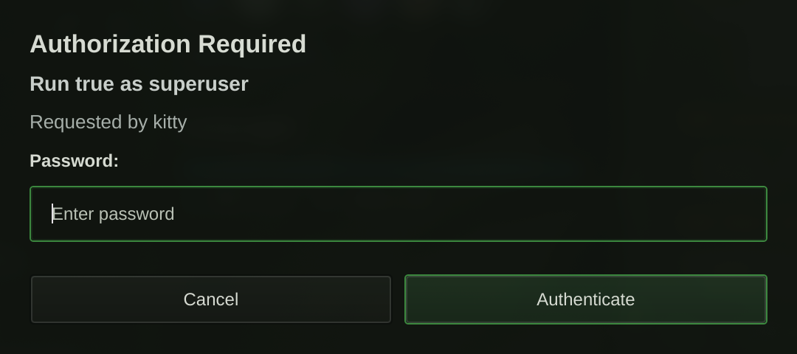

# noctalia-polkit
A simple polkit authentication agent for Hyprland/Wayland, written in Qt/QML.



## Install

### Arch / Fedora / Debian/Ubuntu

Dependencies (names vary by distro): Qt6 base, polkit-qt6, polkit, hyprutils, cmake, pkg-config.

```bash
cmake -S . -B build -DCMAKE_INSTALL_PREFIX=/usr
cmake --build build
sudo cmake --install build
```

Enable the user service:

```bash
systemctl --user daemon-reload
systemctl --user enable --now noctalia-polkit.service
```

Notes:
- Use `/usr/local` if you want a local install.
- The agent binary installs to `libexec` under the chosen prefix (for example, `/usr/libexec/noctalia-polkit`).
- The Noctalia plugin connects over IPC at `$XDG_RUNTIME_DIR/noctalia-polkit-agent.sock`.

### NixOS / Nix

```bash
nix build .#noctalia-polkit
# or install into your user profile:
nix profile install .#noctalia-polkit
```

Then enable the user service:

```bash
systemctl --user daemon-reload
systemctl --user enable --now noctalia-polkit.service
```
